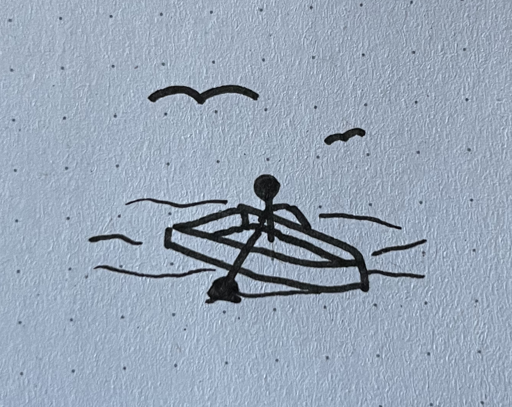

# 🖥️ Browser Technologies

Gemaakt door Stefan Radouane

Minor Web design and Development - 2022/2023

De demo is te bekijken via deze [link](http://localhost:4000).

## 📁 Case - Online foto album

Ik heb gekozen voor de case een online foto album.

### 🔌 Core functionaliteiten

De core functionaliteiten van deze app zijn:

- Foto toevoegen aan een verzameling met meta-info zoals beschrijving, locatie, fotograaf, alt-tekst
- Detailpagina foto
- Overzichtspagina alle foto's
- Serie samenstellen (welke foto's en in welke volgorde)
- Overzichtspagina van een serie
- Serie als carrousel aanbieden
- (Visuele) waarschuwing als er geen alt-tekst is.

### 🛹 Wat is Progressive enhancement & Feature detection

#### Progressive enhancement

<details>
<summary>Wat is progressive enhancement</summary>

Progressive Enhancement is een ontwerpfilosofie voor webontwikkeling die erop gericht is om een optimale gebruikerservaring te bieden aan alle gebruikers, ongeacht hun apparaat, browser of verbindingssnelheid.

Het idee achter Progressive Enhancement is dat je begint met een basisversie van je website of webapplicatie die op alle apparaten en browsers werkt. Vervolgens voeg je meer geavanceerde functies en ontwerpelementen toe voor gebruikers met moderne browsers en apparaten die deze functies en elementen kunnen ondersteunen.

Met Progressive Enhancement is het dus belangrijk om te focussen op de basisfunctionaliteit van je website en deze goed te laten werken, voordat je geavanceerde functies en ontwerpelementen toevoegt. Op deze manier zorg je ervoor dat alle gebruikers, ongeacht hun apparaat of browser, toegang hebben tot de belangrijkste informatie en functionaliteit van je website.

</details>

#### Feature detection

<details>
<summary>Wat is feature detection</summary>

Het idee achter "feature detection" is dat je een test kan uitvoeren om te bepalen of een bepaalde functie ondersteund wordt door de huidige browser, en dan afhankelijk van de uitkomst van die test code kan uitvoeren om een acceptabele gebruikerservaring te bieden in zowel browsers die de functie wel ondersteunen als browsers die dat niet doen. Als je dit niet doet, kunnen browsers die de functies die je gebruikt in je code niet ondersteunen, je website mogelijk niet goed weergeven of zelfs helemaal falen, wat resulteert in een slechte gebruikerservaring.

Kort gezegd gaat het erom dat je bij het ontwikkelen van een website of webapplicatie er niet vanuit moet gaan dat alle browsers dezelfde functies ondersteunen. Door "feature detection" te gebruiken kan je controleren of een bepaalde functie beschikbaar is in de browser van de gebruiker, en vervolgens code uitvoeren die werkt met de beschikbare functies, in plaats van te vertrouwen op functies die mogelijk niet beschikbaar zijn en daardoor problemen veroorzaken. Dit helpt ervoor te zorgen dat je website of webapplicatie werkt zoals bedoeld, ongeacht welke browser de gebruiker gebruikt.

```JAVASCRIPT
if ("geolocation" in navigator) {
  navigator.geolocation.getCurrentPosition(function(position) {
    // show the location on a map, such as the Google Maps API
  });
} else {
  // Give the user a choice of static maps
}
```

> Dit is een voorbeeld van feature detection dat checkt of geolocation beschikbaar is in de browser.

</details>

## 🧪 Test verslag

### ☁️ Feature lijst.

1. Feature
2. Feature
3. Feature

#### Feature

De feature word in de volgende browsers ondersteund:



## Bronnen

1. [Wat is progressive enhancement - MDN](https://developer.mozilla.org/en-US/docs/Glossary/Progressive_Enhancement)
2. [Wat is progressive enhancement - Wikipedia](https://en.wikipedia.org/wiki/Progressive_enhancement)
3. [Lagen van progressive enhancement - smashingmagazine](https://www.smashingmagazine.com/2009/04/progressive-enhancement-what-it-is-and-how-to-use-it/)
4. [Wat is feature detection - MDN](https://developer.mozilla.org/en-US/docs/Learn/Tools_and_testing/Cross_browser_testing/Feature_detection)
