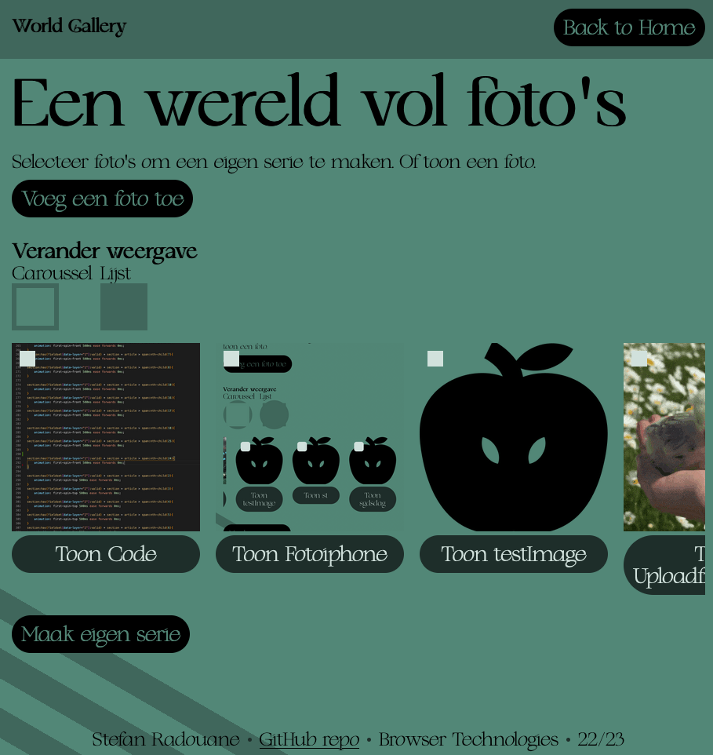
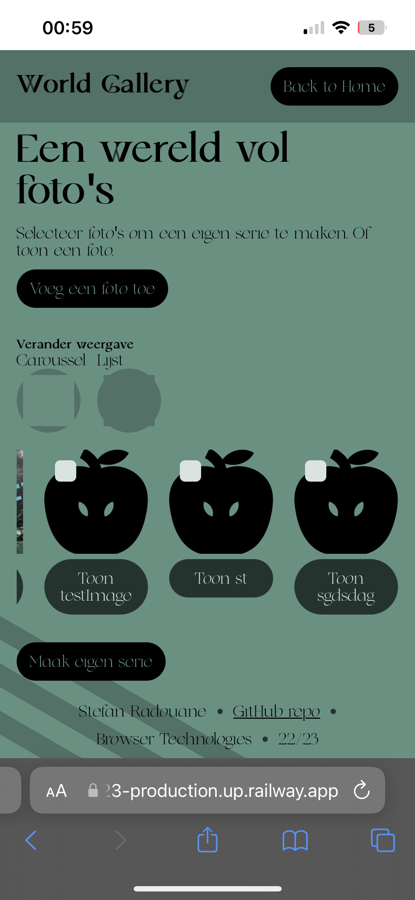
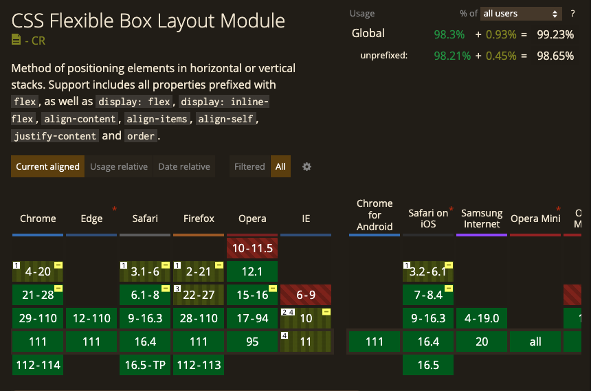
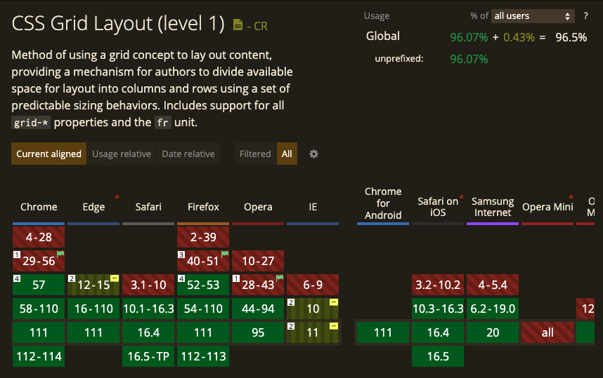

# 🖥️ Browser Technologies

Gemaakt door Stefan Radouane

Minor Web design and Development - 2022/2023

De demo is te bekijken via deze [link](https://browser-technologies-2223-production.up.railway.app/gallery).

## 🔎 Inhoudsopgave

- [💼 Case](#💼-case---online-foto-album)
- [✅ Browser functionaliteiten](#✅-browser-functionaliteiten)
- [🧪 Browser Tests](#🧪-browser-tests)
- [ℹ️ Bronnen](#ℹ️-bronnen)

## 💼 Case - Online foto album

Ik heb gekozen voor de case een online foto album.

### 🔌 Core functionaliteiten

De core functionaliteiten van deze app zijn:

- Foto toevoegen aan een verzameling met meta-info zoals beschrijving, locatie, fotograaf, alt-tekst
- Detailpagina foto
- Overzichtspagina alle foto's
- Serie samenstellen (welke foto's en in welke volgorde)
- Overzichtspagina van een serie
- Serie als carrousel aanbieden
- (Visuele) waarschuwing als er geen alt-tekst is.

### 🛹 Wat is Progressive enhancement & Feature detection

#### Progressive enhancement

<details>
<summary>Wat is progressive enhancement</summary>

Progressive Enhancement is een ontwerpfilosofie voor webontwikkeling die erop gericht is om een optimale gebruikerservaring te bieden aan alle gebruikers, ongeacht hun apparaat, browser of verbindingssnelheid.

Het idee achter Progressive Enhancement is dat je begint met een basisversie van je website of webapplicatie die op alle apparaten en browsers werkt. Vervolgens voeg je meer geavanceerde functies en ontwerpelementen toe voor gebruikers met moderne browsers en apparaten die deze functies en elementen kunnen ondersteunen.

Met Progressive Enhancement is het dus belangrijk om te focussen op de basisfunctionaliteit van je website en deze goed te laten werken, voordat je geavanceerde functies en ontwerpelementen toevoegt. Op deze manier zorg je ervoor dat alle gebruikers, ongeacht hun apparaat of browser, toegang hebben tot de belangrijkste informatie en functionaliteit van je website.

</details>

#### Feature detection

<details>
<summary>Wat is feature detection</summary>

Het idee achter "feature detection" is dat je een test kan uitvoeren om te bepalen of een bepaalde functie ondersteund wordt door de huidige browser, en dan afhankelijk van de uitkomst van die test code kan uitvoeren om een acceptabele gebruikerservaring te bieden in zowel browsers die de functie wel ondersteunen als browsers die dat niet doen. Als je dit niet doet, kunnen browsers die de functies die je gebruikt in je code niet ondersteunen, je website mogelijk niet goed weergeven of zelfs helemaal falen, wat resulteert in een slechte gebruikerservaring.

Kort gezegd gaat het erom dat je bij het ontwikkelen van een website of webapplicatie er niet vanuit moet gaan dat alle browsers dezelfde functies ondersteunen. Door "feature detection" te gebruiken kan je controleren of een bepaalde functie beschikbaar is in de browser van de gebruiker, en vervolgens code uitvoeren die werkt met de beschikbare functies, in plaats van te vertrouwen op functies die mogelijk niet beschikbaar zijn en daardoor problemen veroorzaken. Dit helpt ervoor te zorgen dat je website of webapplicatie werkt zoals bedoeld, ongeacht welke browser de gebruiker gebruikt.

```JAVASCRIPT
if ("geolocation" in navigator) {
  navigator.geolocation.getCurrentPosition(function(position) {
    // show the location on a map, such as the Google Maps API
  });
} else {
  // Give the user a choice of static maps
}
```

> Dit is een voorbeeld van feature detection dat checkt of geolocation beschikbaar is in de browser.

</details>

## ✅ Browser functionaliteiten

De demo is te bekijken via deze [link](https://browser-technologies-2223-production.up.railway.app/gallery).

### 📁 HTML File API

Wanneer je afbeeldingen wilt uploaden op een website, kan de HTML5 File API worden gebruikt om het uploadproces op een gestroomlijnde manier te beheren. De File API maakt het mogelijk om bestanden op de client-side te selecteren en te manipuleren voordat ze worden geüpload naar de server.

Om bestanden te uploaden, kun je een HTML-formulier gebruiken met een input type="file" element. Wanneer een gebruiker een afbeeldingsbestand selecteert in het invoervak, kan je JavaScript gebruiken om het bestand te lezen en te verwerken.

Multer is een middleware voor Node.js dat helpt bij het verwerken van multipart/form-data, een type gegevens dat vaak wordt gebruikt voor het uploaden van bestanden via HTML-formulieren. Multer maakt het mogelijk om eenvoudig bestanden te ontvangen en op te slaan die naar de server worden geüpload.

Als PE op deze upload laat wanneer FileReader beschikbaar is de foto zien in de DOM. Daarnaast wordt de input met naam en datum van de foto automatisch ingevuld met de meta-data van de foto.

Ik heb multer gebruikt op de server om ervoor te zorgen dat de afbeelding hoe dan ook word geupload ongeacht de browser.

### 🏗️ CSS lay-out

De CSS layout is gebruikt als een PE om de afbeeldingen in de foto galerij te ordenen en te stylen. Door het gebruik van CSS Grid en Flexbox is een aantrekkelijke en gemakkelijk te navigeren galerij gecreëerd.

Om de functionaliteit van de website te verbeteren, is JavaScript toegevoegd als PE. Dit maakt het mogelijk om de afbeeldingen te laten scrollen en in een carrousel-indeling te tonen.

Door beide technologieën te combineren en de sterke punten van beide te benutten, wordt een interactieve en visueel aantrekkelijke foto galerij website gebouwd.

Om het gebruiksgemak voor gebruikers te vergroten, is een functionaliteit toegevoegd waarmee de gebruiker kan kiezen tussen een carrousel-weergave en een lijstweergave. Deze functionaliteit is geïmplementeerd met behulp van CSS en JavaScript.

In het kort, de combinatie van CSS, JavaScript en de mogelijkheid om de weergave van de galerij te wisselen, resulteert in een krachtige foto galerij website die aantrekkelijk is voor gebruikers en tegelijkertijd gemakkelijk te navigeren is.

### :spiral_notepad: Filtering

Een backend filter past perfect bij het principe progressive enhancement omdat het de basisfunctionaliteit van een website kan verbeteren zonder afhankelijk te zijn van de mogelijkheden van het apparaat en de browser van de gebruiker. Door het gebruik van een backend filter kunnen de gegevens die aan de frontend worden gepresenteerd, worden geoptimaliseerd voor elk apparaat, browser of netwerksnelheid.

Bijvoorbeeld, als een gebruiker een oudere browser of een langzame netwerksnelheid heeft, kan het ophalen en verwerken van grote hoeveelheden ongefilterde gegevens door de frontend leiden tot een trage en frustrerende gebruikerservaring. Met behulp van een backend filter kunnen deze gegevens eerst worden gefilterd en geoptimaliseerd, zodat alleen de essentiële informatie naar de frontend wordt gestuurd. Dit zorgt voor een snellere en meer responsieve gebruikerservaring voor alle gebruikers.

Bovendien past het gebruik van een backend filter perfect bij de filosofie van progressive enhancement, omdat het de mogelijkheid biedt om extra functionaliteit toe te voegen aan de frontend zonder dat dit ten koste gaat van de basisfunctionaliteit. Met behulp van een backend filter kunnen geavanceerde functies zoals zoeken, filteren en sorteren geleidelijk aan worden toegevoegd aan de frontend, terwijl de basisfunctionaliteit van de website behouden blijft voor alle gebruikers.

Kortom, het gebruik van een backend filter past goed bij de progressive enhancement benadering omdat het de basisfunctionaliteit van een website kan verbeteren zonder afhankelijk te zijn van de mogelijkheden van het apparaat en de browser van de gebruiker, en het biedt de mogelijkheid om extra functionaliteit geleidelijk aan toe te voegen aan de frontend.

## 🧪 Browser tests

Ik heb ook onderzocht hoe mijn website reageert in andere browsers. Dit heb ik getest op de volgende onderdelen. Daarnaast heb ik ook een aantal features onderzocht.

De verschillende browsers zijn:

- Desktop: Chrome, Safari & Firefox
- Mobiel: iOS Safari & Android Chrome
- Obscure browser PrinceXML

De onderzochte features zijn:

1. HTML File API
2. CSS lay-out

Tot slot heb ik ook een test gedaan met een screen reader.

### 💻 Desktop

Ik heb de website getest in Chrome, Safari & Firefox. Ik kwam er al snel achter dat door de wijze het programmeren van de website, met een server die volledig de website rendered elke functionaliteit in elke browser werkt. Met de default functionaliteiten van HTML los ik de meeste dingen op. De default zou daarom ook gemakkelijk kunnen worden enhanced.

De app zou dus op dit moment op elk vlak op de desktop enhanced kunnen worden en zou nogsteeds kunnen werken.

Ik heb zelfs de website getest op een windows 7 met chrome 109 via de website [browserling](https://www.browserling.com/), zelfs op deze windows 7 deed alles het prima en kon ik zelfs foto's uploaden.



### 📱 Mobiel

Net als op de desktop werkte alles op de mobiel precies zoals verwacht.



### 👴 Obscure browser

Naast het testen in normale browsers heb ik mijn website ook getest in een obscure browser. Ik heb gekozen om mijn website te testen in Flow. Flow wordt vaak beschouwd als een obscure browser omdat het geen traditionele webbrowser is, zoals Chrome of Firefox. Flow kan op verschillende multimedia gebruikt worden als browser, zo werkt Flow ook bijvoorbeeld op een Raspberry Pi.

Naast dat Flow een obscure browser is, is het ook een browser die niet veel gebruikt wordt. Dit komt omdat Flow een specifiek doel heeft en niet rechtstreeks toegang biedt tot het internet zoals traditionele webbrowsers. Het begint al bij alleen de site openen, om een url in te voeren moet je het de toetsen `cmd + l` indrukken. Dit is een van de vele dingen die anders zijn in Flow.


> Zoals je op de foto kunt zien is de achtergrond wit en de tekst zwart, dit komt omdat de property `color-scheme: light dark` niet werkt in de Flow browser

Ik heb de website dus ook getest met flow. Alle functionaliteiten zijn exact hetzelfde als in de andere browsers. De website werkt dus ook in een obscure browser. Het enige wat niet werkt is de foto uploaden. Het toevoegen van een foto gaat zonder probleem, alleen de body dat flow naar de server vertuurd bevat een speciaal soort data dat `multer` niet kan verwerken.
Hier is een schermopname van mijn site in Flow.

https://github.com/stefanradouane/browser-technologies-2223/assets/94455025/16af025c-e6ab-4d01-a8bb-ce809b9e5752

> De error die ik krijg van multer komt omdat de foto niet goed wordt geupload. Dit komt omdat de afbeelding in de body van de request niet goed wordt verstuurd. Dit is een probleem dat ik niet heb kunnen oplossen. Ik heb wel een aantal dingen geprobeerd, maar ik heb geen oplossing kunnen vinden.

Het filteren van de foto's werkt wel naar verwachting. Hier is de video waarin je ziet hoe de filter ook in de obscure browser werkt.

https://github.com/stefanradouane/browser-technologies-2223/assets/94455025/17805e96-3193-42db-9eae-727cd1d45aea

### ✨ Feature: HTML File API

Deze feature word in de volgende browsers ondersteund:

- Chrome
- Safari
- Firefox


Zonder javascript doet deze functionaliteit het niet. Het is dus ook niet mogelijk om een foto te tonen die je hebt geupload met een input file.

### ✨ Feature: CSS lay-out

Deze feature bestaat uit twee onderdelen, flex lay-out en grid lay-out. Ik heb beide lay-out typen onderzocht. Met prefixes heeft flex een usage van 99.23%. Het is dus in vrijwel elke browser geimplementeerd. Grid heeft daarnaast een iets lagere usage met prefixes. De usage van grid is 96.5%. Beide scoren dus vrij hoog en zijn dus ook te gebruiken om een lay-out mee te stijlen.





### 🔈 Screen reader test.

Ik heb een test gedaan met een sreen reader. Ik heb hiervoor de chrome extentie <a href="https://chrome.google.com/webstore/detail/screen-reader-by-userway/ompobmbbbjcmoeepdplbindbbpmbncka">Screen Reader by UserWay</a> gebruikt. Deze extentie is gratis te downloaden in de chrome webstore. Ik heb de website getest met deze screen reader. Uit de test bleek dat de website goed te gebruiken is met een screen reader. De screen reader las alle tekst goed voor en de website was goed te navigeren. Ik heb een schermopname gemaakt van de test. Deze is hieronder te zien.

https://github.com/stefanradouane/browser-technologies-2223/assets/94455025/dacbb051-243e-4d49-8352-58dc73c08ded

## ℹ️ Bronnen

1. [Wat is progressive enhancement - MDN](https://developer.mozilla.org/en-US/docs/Glossary/Progressive_Enhancement)
2. [Wat is progressive enhancement - Wikipedia](https://en.wikipedia.org/wiki/Progressive_enhancement)
3. [Lagen van progressive enhancement - smashingmagazine](https://www.smashingmagazine.com/2009/04/progressive-enhancement-what-it-is-and-how-to-use-it/)
4. [Wat is feature detection - MDN](https://developer.mozilla.org/en-US/docs/Learn/Tools_and_testing/Cross_browser_testing/Feature_detection)
5. [CSS usage - MDN](https://caniuse.com/)
6. [Screen Reader by UserWay](https://chrome.google.com/webstore/detail/screen-reader-by-userway/ompobmbbbjcmoeepdplbindbbpmbncka)
